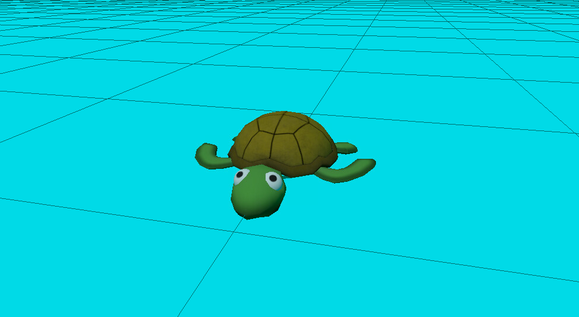
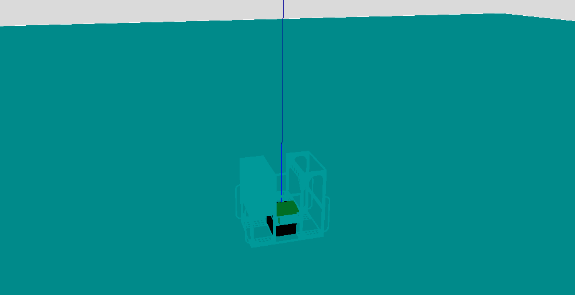
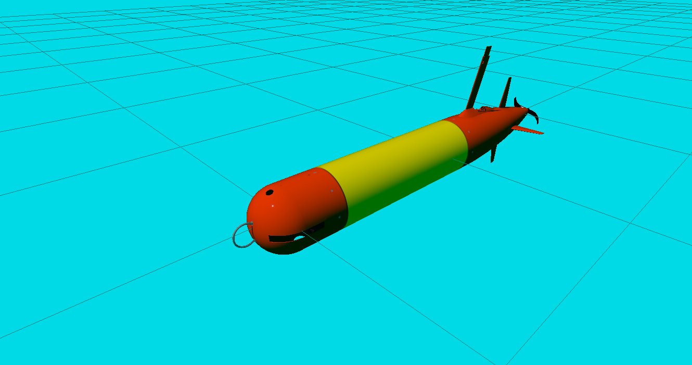

# Gazebo Maritime
Implementation of the basic simulation of underwater vehicles provided by Gazebo Sim documentation (https://gazebosim.org/api/sim/8/tutorials.html)
The repository contains 3 projects:
- Surface turtle enabled by Buoyancy, Trajectory, and Hydrodynamics plugins.
- Buoyant lander with detachable weight system implementing Buoyancy, Detachable Joint System, and Hydrodynamics plugins.
- Buoyant AUV implementing a Thrusting system, Drag, partial Buoyancy, and Hydrodynamics plugins.

All projects are developed only using Gazebo Sim and do not require other software.

Use ```export GZ_SIM_RESOURCE_PATH=:$HOME/gazebo_maritime/models``` in order to load the models before executing the *.sdf* files with ```gz sim```

*Buoyant Turtle:*



*Buoyant Lander:*



*Buoyant AUV:*

